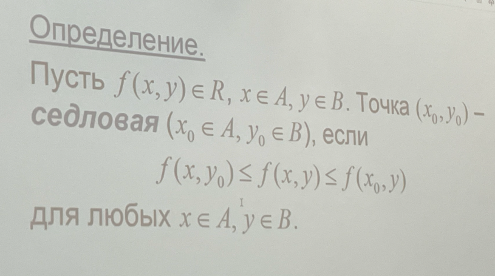
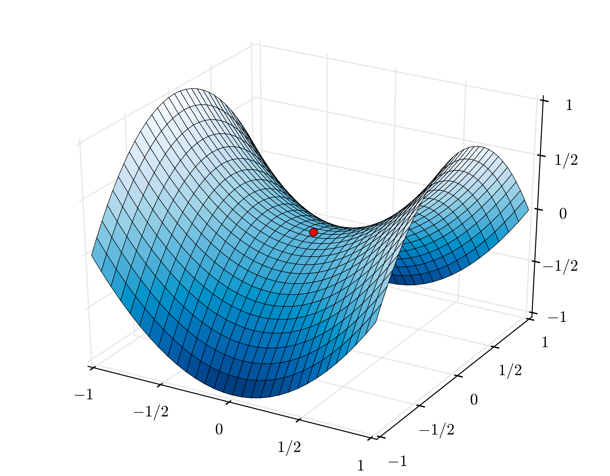
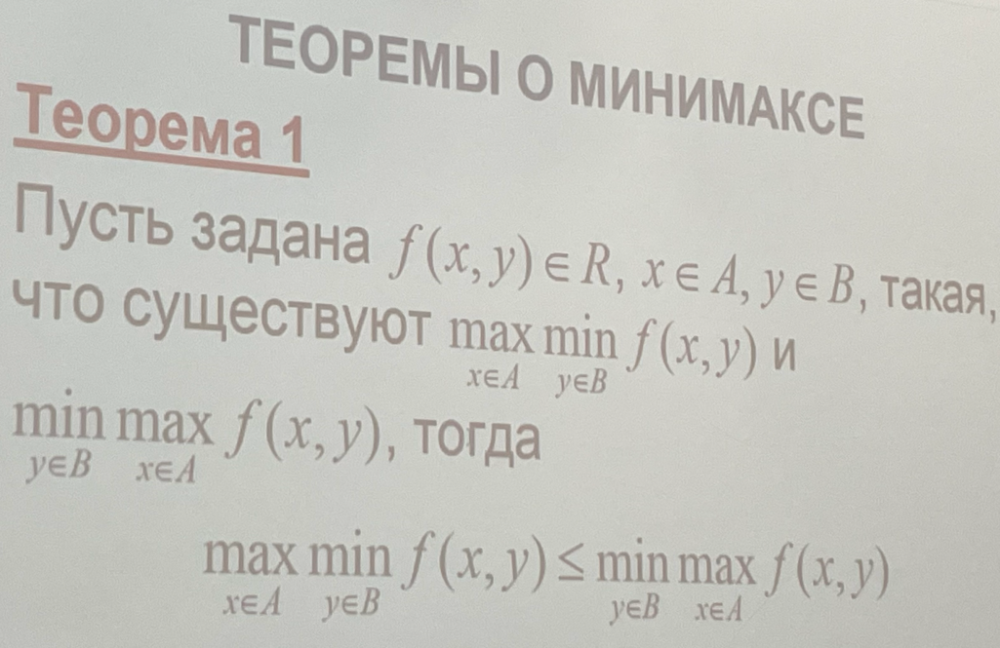
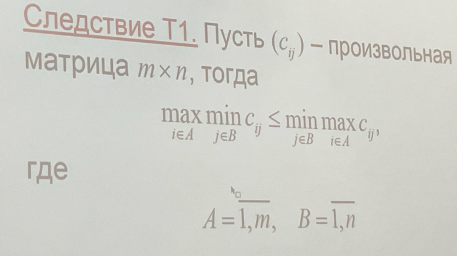
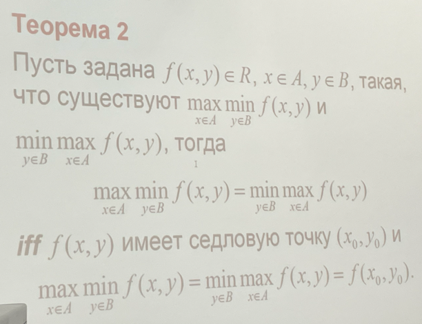
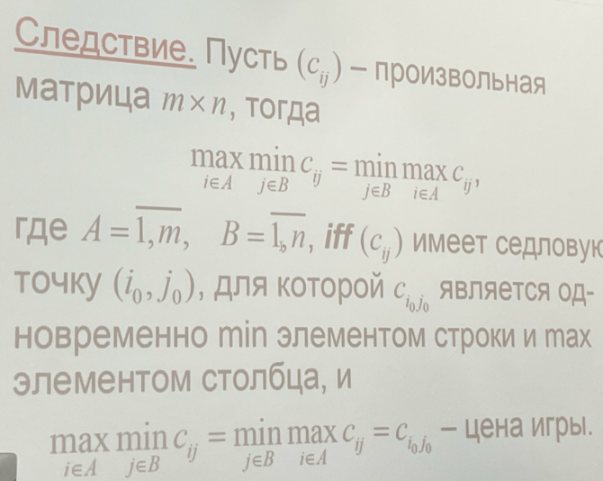
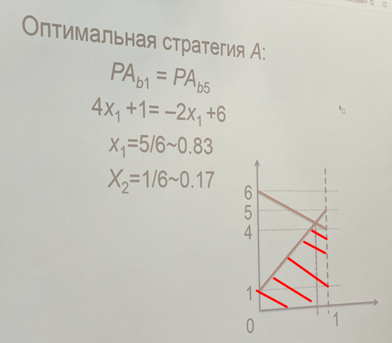
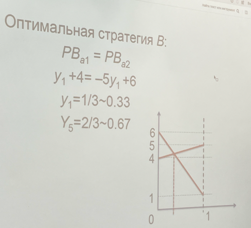

Задана платежная матрица прямоугольной игры с нулевой суммой.
Вариант 1.

| 4  | -3 | 5  | 6  | 4 |
|:--:|:--:|:--:|:--:|:-:|
| 6  | 5  | -3 | 4  | 7 |
| 6  | 5  | -3 | -3 | 5 |
| -3 | -3 | 4  | 4  | 4 |
| 7  | 6  | 4  | 5  | 6 |

В процессе выполнения домашнего задания необходимо сделать следующее.

1. Нормализовать матрицу (привести к матрице с неотрицательными элементами) и свести исходную игру к матричной игре
   (2 × 2) следующими способами:
   - поглощением доминируемых стратегий;
   - удалением NBR-стратегий (Never Best Response).
2. Найти смешанные стратегии игроков следующими методами:
   - графоаналитическим;
   - аналитическим (матричным);
   - графически (задача ЛП);
   - симплекс-методом (задача ЛП).
3. Рассчитать цену игры для исходной матрицы.

## Немного теории

**Доминируемая (поглощающая) строка** содержит элементы >= элементам другой строки (поглощаемой).

**Доминируемый (поглощающая) столбец** содержит элементы <= элементам другого столбца (поглощаемого) .

**Нижняя цена игры (максимин):** $\max_j \min_i c_{ij}$

**Верхняя цена игры (минимакс):** $\min_i \max_j c_{ij}$

Если они совпадают, то точка на пересечении называется **седловой точкой**.
Соответствующий элемент одновременно является наименьшим в строке и наибольшим в столбце и равен цене игры.

**Теоремы о минимаксе**

**Смешанная стратегия** - вероятностная стратегия (**когда седловой точки нет** только для мат ожидания).

Граф. метод: по Ox - вероятность от 0 до 1, по Oy - выигрыши
Выбираем максимум из нижних сегментов графика

Выбирает минимум из двух максимальных сегментов графика
